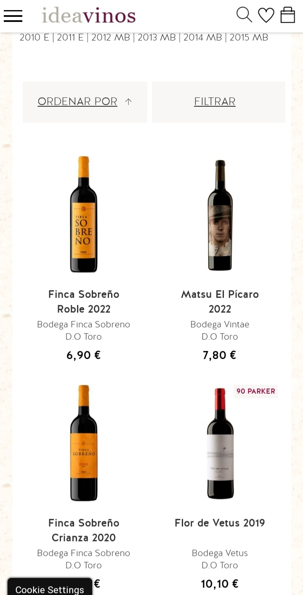
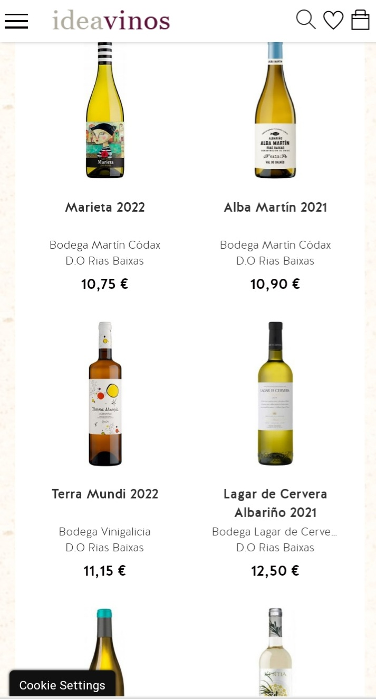

> # THE GOOD WINE
> 
> Creado por: Alba María Álvarez Alonso
>
> ## RESUMEN
> 
>Esta aplicación está diseñada para ayudarte a elegir vino según la denominación de origen. Muchos usuarios conocen los tipos de vino, como tinto, rosado y blanco, pero no saben qué marcas pertenecen a cada denominación de origen. La aplicación resuelve esta incertidumbre al proporcionar información detallada sobre las marcas y sus respectivas denominaciones de origen. Además de facilitar el proceso de compra, la aplicación también ofrece datos curiosos sobre el vino.
>
>
> ## Pantallas 
>
> * Pantalla de incio: Presenta el nombre de la aplicación. Desaparece a los 4 segundos, dando paso a la pantalla inicial
>   
>   
>
> * Pantalla inicial: Solicita al usuario que seleccione si es mayor o menor de edad. Si es menor de edad, se le indica que regrese cuando sea mayor y la aplicación se cierra después de 3 segundos.
>
>   
>
>   Si es mayor de edad, accede a una pantalla que ofrece recomendaciones de consumo moderado y responsable según la Federación Española del Vino. Desde esta página inicial, se puede acceder al menú lateral y a la página de selección de vinos.
>   
>  
>   
> * Menú lateral : Desde este menú lateral se accede directamente a la pantalla de cada vino desde donde acceder a la compra.
>   
>  
>
> * Barra de aplicación: Contiene un icono de una botella para acceder a la página de compra, y un icono para acceder al menú lateral, además de aparacer el nombre de la aplicación.
>   
>  
>
> * Pantalla de recomendación FEV : En esta pantalla se recomienda un consumo moderado de vino, indicándose las cantidades que recomienda la Federación ESpañola del Vino.
En la barra de aplicación se muestra el texto " Beba con moderación".
>
>  
>
>
> * Pantalla de selección : Permite al usuario elegir entre comprar o explorar. En la opción de compra, se muestran los tres tipos de vino, cada uno representado por su color característico. Al hacer clic en uno, se accede a las denominaciones de origen asociadas y se proporciona un enlace a una página web para realizar la compra. Desde aquí, se puede volver a la página de selección de colores. En la opción de explorar, se muestran curiosidades sobre el vino.
>   
>  
>
> * Pantalla curiosear: Esta pantalla tiene varias entradas acerca de curiosidades sobre el vino y a través de la barra de aplicación se puede acceder a la página de compra, o se puede regresar a la página de selección a través de la flecha de retroceso que está en el margen izquierdo de la barra de aplicación. Tiene implementado un scroll así como un menú colapsable que se funde a negro con la barra de aplicación al moverse hacia abajo.
>   
>  
>  
>
> *  Pantalla de compra : Muestra los tres colores representativos de cada tipo de vino. Al seleccionar uno, se accede a una pantalla con las denominaciones de origen disponibles y enlaces a páginas web para comprar.
>   
>   
>
>
>  * Pantalla detalle vino: Permite acceder a la página de compra de un vino específico. Se puede regresar a la página de selección de colores utilizando la flecha de retroceso. Si se accede a través del menú lateral, la flecha de retroceso lleva de vuelta a la pantalla inicial.  
>        
         
         
>
>  Un ejemplo de las webs a las que accederíamos al clicar en una de las opciones de vino :  
          
          
          
        
> ## DISEÑO
>    Las imágenes la he creado con Photoshop.
       Para la creación de los layouts he utilizado FrameLayout en su mayoría, y ConstraintLayout para las pantallas de las D.O. de los vinos
>  ### Herramientas de Desarrollo
> * Android Studio
> * Photoshop
> * Canvas
>
>   
